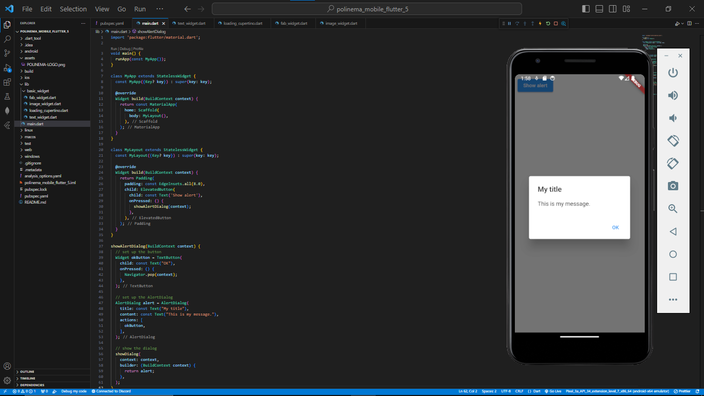

## Laporan Pertemuan 5

## Praktikum 3

# Langkah 1: Text Widget

Mengganti teks dengan nama Ilham Khalis Putra Agatha

# Langkah 2: Image Widget

Menampilkan logo polinema

## Praktikum 4

# Scaffold Widget

Mengatur tata letak sesuai dengan material design

# Dialog Widget

Menambahkan alert dialog

# Input dan Selection Widget

Menambahkan widget berupa input field untuk menerima inputan dari user

# Date and Time Pickers

Menambahkan date and time picker, yang dapat menerima input berupa selection

